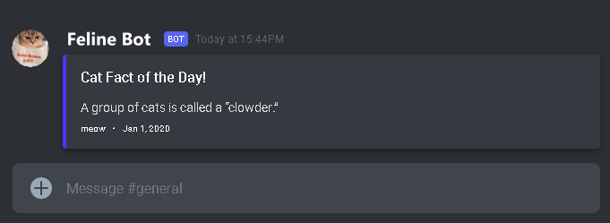

# M122 - Daily Feline Facts

Dieses Python und Bash Projekt holt ein zufälliges Katzenfakt und publiziert es mit einem Discord WebHook auf deinen Discord Server nach Wahl!  
Während der Server an ist, schickt es einen Katzenfakt regelmässig. Katzenbild kann im Endprodukt inkludiert sein.

Embed WebHook Mockup Beispiel:  

### To-Do

###### obligatorische Kriterien
- [x] Verwende [catfact.ninja API](https://catfact.ninja/) um Katzenfakten zu erhalten.
- [x] Erstelle einen Discord Server mit einem Kanal für Katzen Fakten und einen WebHook. [Link to Discord Server](https://discord.gg/GHsjrUvY2n)
- [x] Verarbeite die Rohdaten der Katzen Fakten
- [x] Verschicke es mittels dem Discord WebHook
- [x] Logge alle Resultate in einer LOG-Datei

###### optionale Kriterien
- [x] Intergriere die Optionen in der CFG-Datei für Intervalle, Aesthetik, etc.
- [ ] Zufälliges Katzen Bild inkludiert von der Seite [Cat As A Service](https://cataas.com/)
- [x] Embed Nachricht Farbe und Text kann konfiguriert werden
